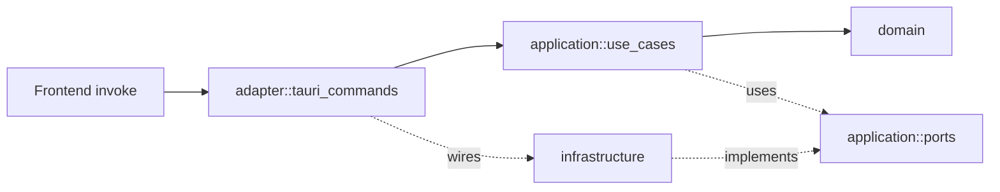

# AGENTS.md

범용 LLM 에이전트(Codex, Cursor, Aider 등)를 위한 작업 가이드.
Claude Code 사용자는 [`CLAUDE.md`](./CLAUDE.md)를 함께 따른다.

## 한눈에

ESC/POS 영수증 바이너리를 HTML로 변환하는 Tauri 2 데스크톱 앱.

- pnpm monorepo, Node 20+ / pnpm 9+ / Rust stable
- Frontend: React + TS + Vite + shadcn/ui + **Feature Sliced Design**
- Native: Rust + Tauri 2 + **Hexagonal Architecture**

## 디렉토리

```
.
├── apps/
│   └── desktop/
│       ├── src/                # FSD (React)
│       │   ├── app/            # 부트스트랩, providers, 전역 스타일
│       │   ├── pages/          # 라우트 화면
│       │   ├── widgets/        # 페이지 구성 블록
│       │   ├── features/       # 사용자 행위 단위
│       │   ├── entities/       # 도메인 표현
│       │   └── shared/         # ui(shadcn), lib, api, config
│       └── src-tauri/
│           └── src/            # Hexagonal (Rust)
│               ├── domain/
│               ├── application/{ports,use_cases}/
│               ├── infrastructure/{parsers,renderers}/
│               └── adapter/tauri_commands.rs
├── packages/                   # 향후 공유 패키지
├── CLAUDE.md
├── AGENTS.md (이 파일)
└── README.md
```

## 명령어 (루트에서 실행)

```bash
pnpm install              # 의존성 설치
pnpm dev                  # Tauri 개발 모드
pnpm dev:web              # 프론트만 (브라우저)
pnpm build                # 프로덕션 번들
pnpm test                 # Vitest
pnpm test:rust            # cargo test
pnpm typecheck            # 전체 TS 타입체크
pnpm format               # Prettier
```

## 규칙 — Frontend (FSD)

레이어 의존성은 단방향: `app → pages → widgets → features → entities → shared`.

- 슬라이스 외부에서는 슬라이스의 `index.ts` 배럴만 import. 내부 파일 직접 import 금지.
- 동일 레이어 간 cross-import 금지.
- 비즈니스 로직은 Rust(application)로 위임. FE는 UI/IPC 호출 담당.
- shadcn/ui 컴포넌트는 `src/shared/ui/`에 위치 (`components.json`).
- 경로 별칭: `@/...` → `src/...`.

## 규칙 — Native (Hexagonal)



- 의존성 방향: `adapter → application → domain`. `infrastructure`는 `application::ports`의 구현만 제공.
- `domain`은 프레임워크/IO 크레이트(`tauri`, IO 등) 금지. 허용 범위: **std + `serde` + 값 타입 라이브러리(`uuid`, `chrono`)**.
- 유스케이스는 제네릭으로 ports를 주입 (`fn new<P: Port, R: OtherPort>(...)`).
- 오류는 `domain::DomainError`로 모으고, `adapter::CommandError`로 IPC 경계에서 매핑.
- 새 Tauri command는 `adapter::tauri_commands`에 추가 + `lib.rs::run`의 `invoke_handler!`에 등록.

## 새 기능 추가 절차

1. **도메인 모델** 검토/확장: `domain/document.rs`
2. **포트** 정의: `application/ports/<port>.rs` 트레잇 추가
3. **유스케이스** 작성: `application/use_cases/<case>.rs` (포트 제네릭 주입, `#[cfg(test)]`로 stub 단위 테스트)
4. **구현체** 작성: `infrastructure/<area>/<impl>.rs`에서 포트 구현
5. **IPC 노출**: `adapter/tauri_commands.rs`에 `#[tauri::command]` 함수 + `lib.rs::run` 등록
6. **Frontend**: `shared/api/tauri.ts::call()`로 호출, 결과를 entities/features에 반영
7. **테스트**: `cargo test` + `vitest`

## 코드 스타일

- 주석은 *왜*가 비자명할 때만. *무엇*은 식별자로 충분.
- TS strict, Rust clippy 깔끔하게.
- 다이어그램은 항상 Mermaid (ASCII art 금지).
- 사용자 응대 언어: 한국어. 식별자/명령은 원형.

## 함정

- shadcn/ui CLI는 기본적으로 `src/components/ui`에 떨어뜨림 → `components.json`에서 `@/shared/ui`로 재매핑되어 있다. 함부로 바꾸지 말 것.
- Tauri 2의 capability JSON 스키마 경로는 빌드 시 생성되는 `gen/schemas`를 가리킨다. 첫 빌드 전에는 IDE 경고가 정상.
- `apps/desktop/src-tauri/Cargo.lock`은 워크스페이스 루트가 아닌 `src-tauri` 안에 생성된다 (서브 크레이트).
