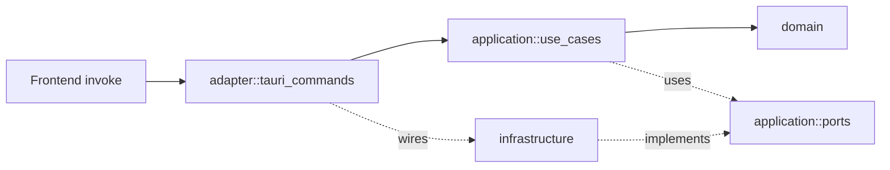

# CLAUDE.md

Claude Code 작업 가이드. **모든 응답은 한국어**로, 코드 식별자/명령은 원형 유지.

## 프로젝트 개요

ESC/POS 영수증 바이너리를 HTML로 변환하는 Tauri 2 데스크톱 앱.

- **워크스페이스**: pnpm monorepo (`apps/*`, `packages/*`)
- **Frontend (`apps/desktop/src`)**: React + TypeScript + Vite + shadcn/ui + **Feature Sliced Design**
- **Native (`apps/desktop/src-tauri/src`)**: Rust + Tauri 2 + **Hexagonal Architecture**

## 명령어

| 목적 | 명령 |
| --- | --- |
| 개발 (Tauri) | `pnpm dev` |
| 개발 (웹만) | `pnpm dev:web` |
| 프로덕션 빌드 | `pnpm build` |
| 프론트 테스트 | `pnpm test` (Vitest) |
| Rust 테스트 | `pnpm test:rust` (cargo test) |
| 타입체크 | `pnpm typecheck` |
| 포맷 | `pnpm format` |

## Frontend: Feature Sliced Design

레이어 의존성은 **단방향**이다. 위에서 아래로만 import.

```
app → pages → widgets → features → entities → shared
```

| 레이어 | 역할 | 위치 |
| --- | --- | --- |
| `app` | 부트스트랩, 전역 providers, 라우팅, 스타일 | `src/app` |
| `pages` | 라우트 단위 화면 | `src/pages/<page>/` |
| `widgets` | 페이지 구성 블록 (header, sidebar, preview…) | `src/widgets/<widget>/` |
| `features` | 사용자 행위 (file-upload, copy-html…) | `src/features/<feature>/` |
| `entities` | 도메인 표현 모델 + 카드/리스트 등 표현 | `src/entities/<entity>/` |
| `shared` | UI 키트(shadcn/ui), 유틸, Tauri API 래퍼, 설정 | `src/shared/` |

**슬라이스 내부 구조**: `ui/`, `model/`(상태), `api/`(외부 호출), `lib/`(유틸), `config/`. 필요한 것만 둔다.

### 규칙

1. 슬라이스 외부에서는 슬라이스의 **public API(`index.ts` 배럴)** 만 import한다. 내부 파일 직접 import 금지.
2. 같은 레이어 슬라이스끼리는 import 금지 (예: `features/a`가 `features/b`를 import할 수 없다).
3. 비즈니스 로직은 가능한 한 Rust(application 레이어)로 위임. FE는 UI/입력 검증/IPC 호출만.
4. shadcn/ui 컴포넌트는 `src/shared/ui/`에 둔다 (`components.json`에 매핑됨).
5. 경로 별칭: `@/...` → `src/...`.
6. 새 슬라이스를 만들 땐 `index.ts` 배럴을 함께 만들어 노출 표면을 좁힌다.

### shadcn/ui 추가

```bash
pnpm --filter @escpos/desktop dlx shadcn@latest add <component>
```
설치된 컴포넌트는 `src/shared/ui/`에 떨어진다.

## Native: Hexagonal Architecture



| 모듈 | 역할 | 의존 가능 대상 |
| --- | --- | --- |
| `domain` | 엔티티/값 객체/도메인 오류 | (none, serde만) |
| `application::ports` | driven 포트 트레잇 | `domain` |
| `application::use_cases` | 비즈니스 시나리오 | `domain`, `application::ports` |
| `infrastructure` | 포트 구체 구현 (driven adapters) | `domain`, `application::ports` |
| `adapter::tauri_commands` | driving adapter (IPC 진입점, DI 조립) | 위 모두 |

### 규칙

1. **의존성 방향**: `adapter → application → domain`. 역방향 import 금지.
2. `infrastructure`는 오직 `application::ports`의 구현체만 제공한다.
3. `domain`은 프레임워크/IO 크레이트(`tauri`, `tokio`, `reqwest`, `axum`, `std::fs` 등)에 의존하지 않는다. 허용 범위는 **std + `serde` + 값 타입 라이브러리(`uuid`, `chrono`)** 까지로 한정한다. 새로운 외부 크레이트를 도메인에 들이려면 `application`/`infrastructure`로 옮길 수 없는지 먼저 검토한다.
4. 유스케이스는 **제네릭으로 포트를 주입**한다 (`fn new<P: Port>(...)`). 트레잇 객체보다 단형화로 성능 + 테스트 용이.
5. 새 유스케이스 추가 시:
   - 필요한 추상은 `application::ports`에 트레잇으로,
   - 구체 구현은 `infrastructure`에,
   - IPC 노출은 `adapter::tauri_commands`에 `#[tauri::command]` 함수로 등록 + `lib.rs::run`의 `invoke_handler!`에 추가.
6. 오류는 `domain::DomainError`로 통일하고, IPC 경계에서 `adapter::CommandError`로 매핑한다.
7. Tauri plugin/file system 접근 등 OS 의존은 반드시 `infrastructure`에 격리.

### 테스트

- 유스케이스는 stub 포트로 단위 테스트 (예: `convert_escpos_to_html.rs` 하단의 `#[cfg(test)]`).
- `infrastructure` 어댑터는 통합 테스트로 검증.

## 코드 스타일

- **주석은 기본적으로 쓰지 않는다.** 이유가 비자명할 때만 한 줄.
- TS: `strict` 모드. 불필요한 `any` 금지.
- Rust: `clippy` 규칙 준수. `unwrap()`은 테스트 코드와 명백히 안전한 곳에서만.
- 임포트 정렬: 외부 → 내부(`@/...`) 순.

## 변경 시 체크리스트

- [ ] 새 FSD 슬라이스에 `index.ts` 배럴이 있는가
- [ ] 레이어 의존성이 단방향인가 (FSD/Hex 둘 다)
- [ ] 새 Tauri command가 `lib.rs::run`의 `invoke_handler!`에 등록되었는가
- [ ] 새 포트가 `application::ports`에 트레잇으로 선언되었는가
- [ ] `pnpm typecheck` 및 `pnpm test` 통과
- [ ] `cargo test --manifest-path apps/desktop/src-tauri/Cargo.toml` 통과

## 자주 가는 위치

- Frontend 엔트리: `apps/desktop/src/main.tsx`
- 라우트 진입: `apps/desktop/src/pages/converter/ui/ConverterPage.tsx`
- Tauri 진입: `apps/desktop/src-tauri/src/lib.rs`
- IPC 커맨드: `apps/desktop/src-tauri/src/adapter/tauri_commands.rs`
- Tauri 설정: `apps/desktop/src-tauri/tauri.conf.json`
