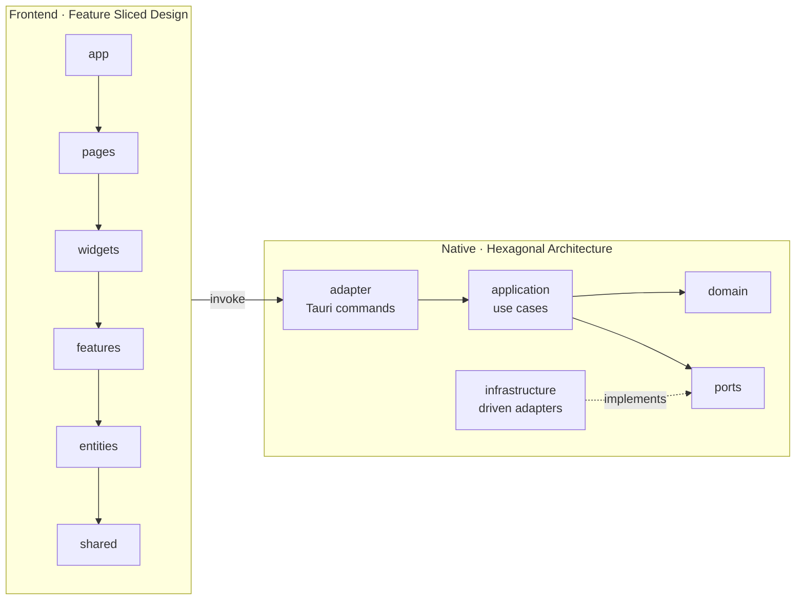

# escpos-to-html

ESC/POS 영수증 바이너리를 HTML로 변환하는 Tauri 기반 데스크톱 애플리케이션.

## 아키텍처 한눈에 보기



## 워크스페이스 구성

- `apps/desktop` — Tauri 2 + React + Vite + shadcn/ui
- `packages/*` — 향후 공유 패키지 위치 (현재 비어 있음)

## 요구 환경

- Node.js 20+
- pnpm 9+
- Rust toolchain (stable)
- Tauri 2 prerequisites: <https://tauri.app/start/prerequisites/>

## 시작하기

```bash
pnpm install
pnpm dev          # tauri dev
pnpm dev:web      # 브라우저에서 프론트만 확인
pnpm build        # tauri 프로덕션 빌드
pnpm test         # vitest + cargo test
```

## 더 읽을거리

- [CLAUDE.md](./CLAUDE.md) — Claude Code 작업 가이드
- [AGENTS.md](./AGENTS.md) — 일반 에이전트(LLM) 작업 가이드
