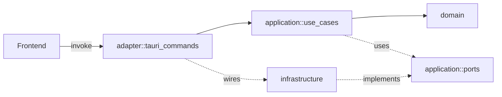

# src-tauri/src · Hexagonal Architecture

## 모듈

- `domain/` — 엔티티, 값 객체, 도메인 오류. 외부 의존 없음.
- `application/use_cases/` — 비즈니스 시나리오. ports를 통해서만 외부와 통신.
- `application/ports/` — driven port 트레잇 (`EscPosParser`, `HtmlRenderer`).
- `infrastructure/` — driven 어댑터 (포트 구현).
- `adapter/tauri_commands.rs` — driving 어댑터. 의존성 조립과 IPC 진입점.

## 규칙

1. 의존성 방향은 `adapter → application → domain` 단방향.
2. `infrastructure` 는 `application::ports` 의 구체 구현만 제공.
3. `domain` 은 `serde` 외의 외부 크레이트에 의존하지 않는다.
4. 유스케이스는 트레잇 객체가 아닌 제네릭으로 ports를 받는다 (성능 + 테스트 용이).
