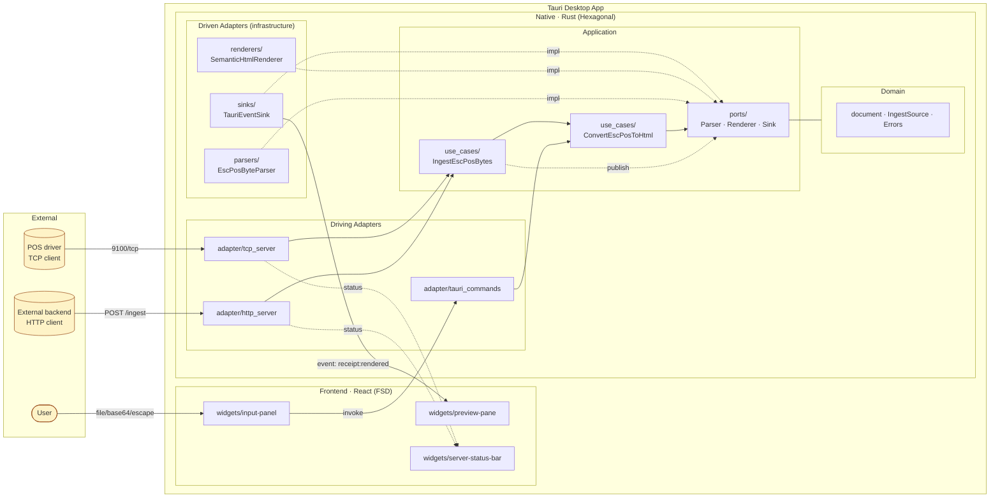
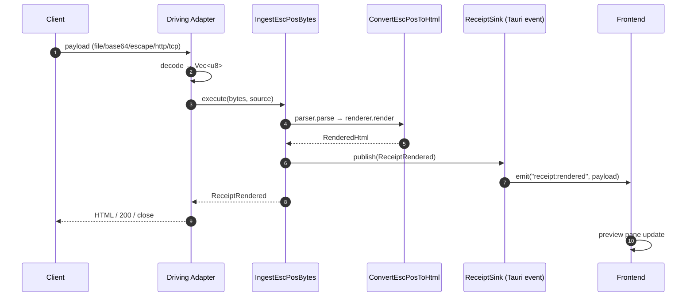
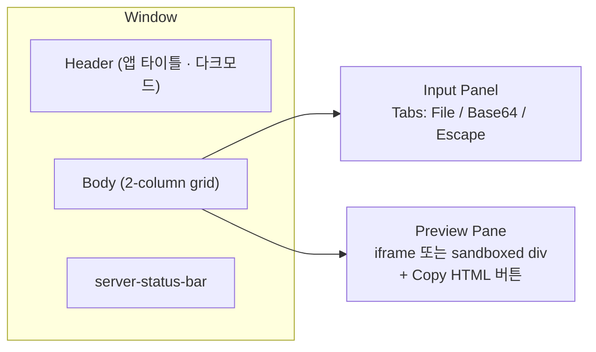
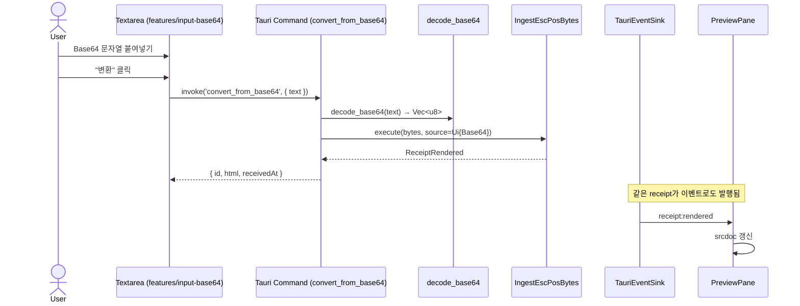
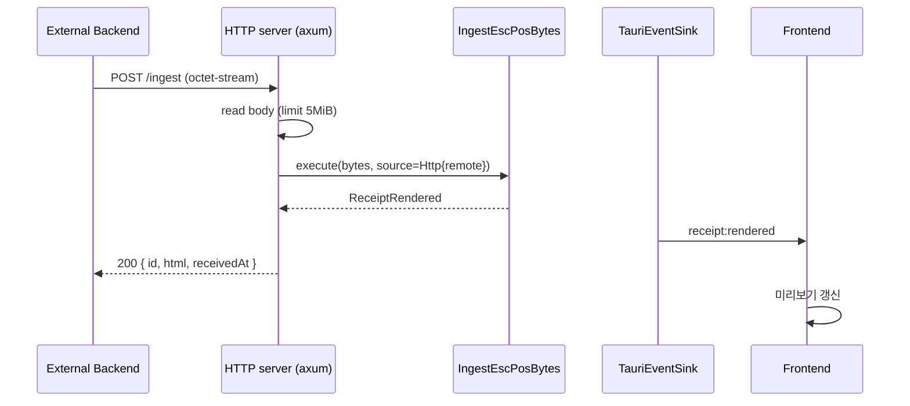
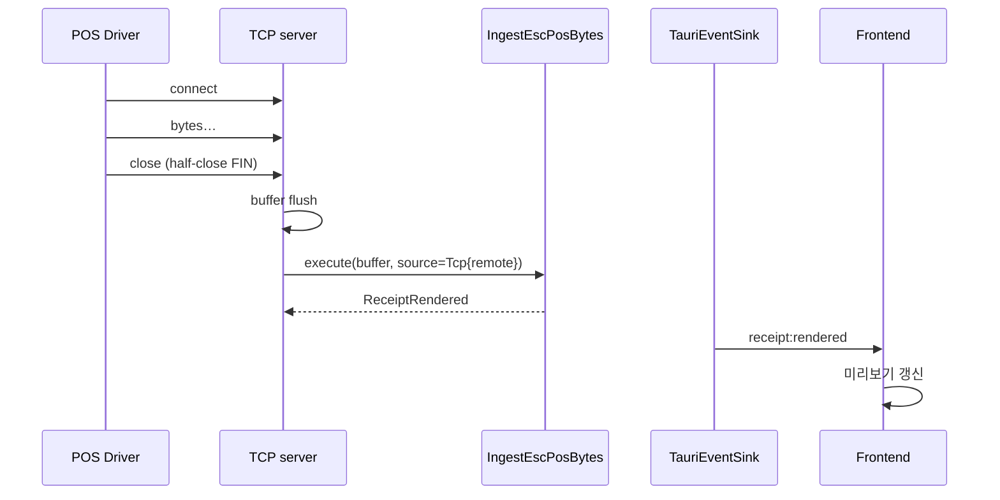

# 영수증 입력·렌더링 통합 설계

- 작성일: 2026-05-19
- 작성자: pyunghyuk.yoo@payhere.in
- 상태: Draft (구현 전)
- 범위: 입력 3종(파일/Base64/Escape Text) + 네트워크 ingest 2종(HTTP/TCP) + 데스크톱 UI 렌더링

---

## 1. 목표와 비목표

### 목표 (in scope)

1. 데스크톱 UI에서 ESC/POS 바이너리를 세 가지 방식으로 입력받아 HTML로 변환·표시.
   - (A) 파일 업로드 (`.bin`, `.prn` 등)
   - (B) Base64 인코딩 텍스트 textarea
   - (C) Escape-sequence 텍스트 textarea (예: `\x1B@\x1Ba\x01Hello\n`)
2. 외부 시스템이 ESC/POS 데이터를 푸시할 수 있는 두 가지 네트워크 ingest.
   - HTTP `POST /ingest` (body = bytes 또는 JSON)
   - TCP RAW (`9100` 포트 기본, 단일 연결 → close = 1 receipt boundary)
3. 모든 입력은 동일한 변환 파이프라인을 거쳐 동일한 HTML로 렌더된다.
4. 네트워크로 들어온 영수증도 데스크톱 UI에 실시간 표시된다 (Tauri 이벤트로 push).

### 비목표 (out of scope, 후속 작업)

- 실제 프린터로 출력 (현 단계는 HTML 미리보기만).
- 멀티 영수증 큐/저장소/검색.
- 인증/멀티테넌시. (네트워크 서버는 `127.0.0.1` 바인딩 기본.)
- 이미지/바코드/QR 완전 지원 (스캐폴딩 단계의 ESC/POS 파서가 우선 텍스트만 처리).

---

## 2. 사용자 시나리오

| 시나리오 | 입력 | 트리거 | 출력 |
| --- | --- | --- | --- |
| S1. 영수증 파일 점검 | `.bin` 파일 | "파일 열기" 버튼 | 우측 패널에 HTML 미리보기 |
| S2. 문서·티켓에서 Base64 추출 검증 | Base64 문자열 | "Base64 → 변환" | 동일 |
| S2'. 디버그 로그의 escape 문자열 검증 | `\x1B@...` | "Escape Text → 변환" | 동일 |
| S3. POS 백엔드 통합 테스트 (HTTP) | `POST /ingest` | 자동 | UI에 즉시 표시 + (옵션) 응답에 HTML 반환 |
| S4. 프린터 드라이버 시뮬레이션 (TCP) | `9100/tcp` raw stream | TCP 연결 종료 | UI에 즉시 표시 |

---

## 3. 시스템 아키텍처

### 3.1 한눈에 보기



### 3.2 핵심 개념

- **단일 진입 데이터 타입**: 모든 ingest 어댑터(파일/Base64/Escape/HTTP/TCP)는 자기 형식을 **`Vec<u8>` ESC/POS 바이트열**로 변환한 다음 application 레이어를 호출한다.
- **단일 변환 파이프라인**: `bytes → EscPosDocument → RenderedHtml`. 어댑터가 무엇이든 결과는 같다.
- **출력 경로의 분기**: 어댑터별로 결과를 어떻게 돌려줄지가 다르다.
  - Tauri command: invoke 반환값으로 HTML 동기 반환 + (옵션) 이벤트 발행.
  - HTTP: HTTP 응답으로 HTML 반환 + 이벤트 발행.
  - TCP: 응답 없음, 이벤트 발행만.

---

## 4. 도메인 모델 변경 (Rust)

### 4.1 신규/확장 타입

```rust
// domain/document.rs (확장)
pub struct EscPosDocument { pub blocks: Vec<Block> }

pub enum Block {
    Text { content: String, style: TextStyle },
    LineFeed,
    Cut,                          // ESC i / GS V
    // 후속: Image, Barcode, QrCode, Table…
}

pub struct TextStyle {
    pub bold: bool,
    pub underline: bool,
    pub double_height: bool,
    pub double_width: bool,
    pub align: Align,             // Left | Center | Right
}

// domain/ingest.rs (신규)
pub enum IngestSource {
    Ui { mode: UiInputMode },     // File | Base64 | EscapeText
    Http { remote: String },      // peer addr 문자열
    Tcp  { remote: String },
}

pub enum UiInputMode { File, Base64, EscapeText }

pub struct ReceiptId(pub uuid::Uuid);     // 후속 의존: uuid
pub struct ReceiptRendered {
    pub id: ReceiptId,
    pub source: IngestSource,
    pub html: RenderedHtml,
    pub received_at: chrono::DateTime<chrono::Utc>,
}

// domain/errors.rs (확장)
pub enum DomainError {
    InvalidInput(String),
    UnsupportedCommand(u8),
    DecodeError(String),          // base64/escape 디코드 실패
    NetworkPayloadTooLarge { size: usize, max: usize },
}
```

> **헥사고날 경계**: 위 타입들은 모두 `std` + `serde` + `uuid` + `chrono` 만 사용한다. `uuid`/`chrono`는 식별·시각을 위한 값 타입 라이브러리로 도메인 의존 허용 범위에 포함시킨다 (CLAUDE.md 정책 갱신 필요 — §10 참고).

### 4.2 신규 포트

```rust
// application/ports/escpos_parser.rs (기존)
pub trait EscPosParser: Send + Sync {
    fn parse(&self, bytes: &[u8]) -> Result<EscPosDocument, DomainError>;
}

// application/ports/html_renderer.rs (기존)
pub trait HtmlRenderer: Send + Sync {
    fn render(&self, doc: &EscPosDocument) -> Result<RenderedHtml, DomainError>;
}

// application/ports/receipt_sink.rs (신규)
pub trait ReceiptSink: Send + Sync {
    fn publish(&self, event: &ReceiptRendered) -> Result<(), DomainError>;
}

// application/ports/clock.rs (신규)
pub trait Clock: Send + Sync {
    fn now(&self) -> chrono::DateTime<chrono::Utc>;
}

// application/ports/id_generator.rs (신규)
pub trait IdGenerator: Send + Sync {
    fn new_receipt_id(&self) -> ReceiptId;
}
```

### 4.3 유스케이스

```rust
// application/use_cases/convert_escpos_to_html.rs (기존, 시그니처 유지)
pub struct ConvertEscPosToHtml<P, R> { parser: P, renderer: R }
impl<P: EscPosParser, R: HtmlRenderer> ConvertEscPosToHtml<P, R> {
    pub fn execute(&self, bytes: &[u8]) -> Result<RenderedHtml, DomainError>;
}

// application/use_cases/ingest_escpos_bytes.rs (신규)
pub struct IngestEscPosBytes<P, R, S, C, I> {
    convert: ConvertEscPosToHtml<P, R>,
    sink: S,
    clock: C,
    id_gen: I,
}
impl<P, R, S, C, I> IngestEscPosBytes<P, R, S, C, I>
where P: EscPosParser, R: HtmlRenderer, S: ReceiptSink, C: Clock, I: IdGenerator {
    pub fn execute(&self, bytes: &[u8], source: IngestSource)
        -> Result<ReceiptRendered, DomainError>
    {
        let html = self.convert.execute(bytes)?;
        let event = ReceiptRendered {
            id: self.id_gen.new_receipt_id(),
            source,
            html,
            received_at: self.clock.now(),
        };
        self.sink.publish(&event)?;
        Ok(event)
    }
}
```

---

## 5. 드라이빙 어댑터 (입력 경로)

### 5.1 Tauri commands — UI 입력 3종

| Command | 인자 | 반환 | 비고 |
| --- | --- | --- | --- |
| `convert_from_bytes` | `bytes: Vec<u8>` | `Result<String, CommandError>` | 파일 업로드용. FE가 `readBinaryFile`로 읽어 전송 또는 dialog plugin으로 path → command가 직접 read |
| `convert_from_base64` | `text: String` | `Result<String, CommandError>` | 입력 텍스트의 whitespace는 무시 |
| `convert_from_escape_text` | `text: String` | `Result<String, CommandError>` | 지원 시퀀스: `\xNN`, `\n` `\r` `\t` `\0` `\\` |
| `server_status` | – | `Result<ServerStatus, CommandError>` | HTTP/TCP 상태 조회 |
| `start_servers` / `stop_servers` | `cfg: ServerConfig` | `Result<(), CommandError>` | 런타임 토글 |

**디코더**는 `adapter::decoders` 모듈에 두고 (드라이빙 어댑터의 일부), Rust에서 처리 → 변환 파이프라인은 항상 `&[u8]` 만 받는다 (단일 진입점).

```rust
// adapter/decoders.rs
pub fn decode_base64(s: &str) -> Result<Vec<u8>, DomainError>;
pub fn decode_escape_text(s: &str) -> Result<Vec<u8>, DomainError>;
```

### 5.2 HTTP server

- 라이브러리: `axum` + `tokio` (이미 검증된 조합, Tauri 2 async runtime과 호환).
- 라우트:

| Method | Path | Request | Response |
| --- | --- | --- | --- |
| POST | `/ingest` | `Content-Type: application/octet-stream` | `200 application/json` `{ "id": "...", "html": "...", "receivedAt": "..." }` |
| POST | `/ingest` | `Content-Type: application/json` `{ "encoding": "base64" \| "escape", "data": "..." }` | 동일 |
| GET | `/health` | – | `200 OK` |

- 바인딩 기본 `127.0.0.1:9101`. (TCP의 `9100`과 충돌 회피.)
- 최대 본문 크기: 5 MiB (config).
- CORS: 기본 비활성. `localhost` 외부 호출이 필요해지면 별도 설정.

### 5.3 TCP server

- 라이브러리: `tokio::net::TcpListener`.
- 바인딩 기본 `127.0.0.1:9100` (ESC/POS RAW JetDirect 관행 포트).
- 프로토콜: **연결 → bytes 누적 → 클라이언트가 close하면 1 receipt로 확정 → 처리**.
  - 시간 기반 segmentation (예: idle 200ms)도 옵션으로 추가 가능하지만 기본은 close-segmented.
- 최대 연결당 누적 크기: 5 MiB (초과 시 연결 강제 종료).
- 동시 연결 한도: 16 (config).

### 5.4 어댑터 → 유스케이스 호출 흐름



> **UI command 경로의 이벤트 발행**: UI에서 invoke한 결과도 sink로 발행하면 멀티 윈도우/히스토리에 일관되게 반영된다.

---

## 6. 드리븐 어댑터 (출력 경로)

### 6.1 `TauriEventSink`

```rust
// infrastructure/sinks/tauri_event_sink.rs
pub struct TauriEventSink {
    app: tauri::AppHandle,
}
impl ReceiptSink for TauriEventSink {
    fn publish(&self, e: &ReceiptRendered) -> Result<(), DomainError> {
        self.app.emit("receipt:rendered", e)
            .map_err(|err| DomainError::InvalidInput(err.to_string()))?;
        Ok(())
    }
}
```

- 이벤트 명: `receipt:rendered`
- 페이로드 (JSON): `{ id, source: { type, mode?, remote? }, html, receivedAt }`

### 6.2 파서·렌더러 (현 단계 stub 유지)

- `NoopEscPosParser` → 텍스트 한 줄짜리 stub. 실제 파서는 별도 PRD.
- `SimpleHtmlRenderer` → `<article class="receipt">…</article>` 출력. 후속 스프린트에서 CSS-styled 영수증으로 확장.

---

## 7. 프론트엔드 설계 (FSD)

### 7.1 슬라이스 구성

```
src/
├── app/
│   └── App.tsx
├── pages/
│   └── converter/
│       └── ui/ConverterPage.tsx        # 좌:입력 / 우:프리뷰 / 하단:서버바
├── widgets/
│   ├── input-panel/                    # 3개 탭(File / Base64 / Escape) 묶음
│   ├── preview-pane/                   # 현재 영수증 HTML
│   └── server-status-bar/              # HTTP/TCP 상태 + start/stop
├── features/
│   ├── upload-file/                    # dialog.open + invoke('convert_from_bytes')
│   ├── input-base64/                   # textarea + invoke('convert_from_base64')
│   ├── input-escape-text/              # textarea + invoke('convert_from_escape_text')
│   ├── listen-receipts/                # listen('receipt:rendered') → store push
│   ├── manage-servers/                 # invoke('start_servers'|'stop_servers')
│   └── copy-html/                      # clipboard copy
├── entities/
│   ├── receipt/                        # ReceiptRendered 타입 + 카드/리스트 UI
│   └── server/                         # ServerStatus 타입 + 표시
└── shared/
    ├── api/tauri.ts                    # invoke 래퍼
    ├── api/events.ts                   # listen 래퍼
    ├── ui/                             # shadcn (Button, Card, Tabs, Textarea, Badge…)
    ├── lib/cn.ts
    └── config/index.ts                 # 기본 포트 등
```

### 7.2 상태 모델

- 단순 React state + Context로 시작. 슬라이스가 늘면 Zustand로 교체.
- 핵심 슬라이스:
  - `currentReceipt: ReceiptRendered | null`
  - `history: ReceiptRendered[]` (최대 20개 LRU)
  - `serverStatus: { http: { running, bind, port }, tcp: { running, bind, port } }`

### 7.3 UI 와이어프레임 (ASCII는 보조용, 실제 디자인은 별도)



### 7.4 이벤트 구독 패턴

```ts
// features/listen-receipts/model/useReceiptStream.ts
useEffect(() => {
  const un = listen<ReceiptRenderedPayload>('receipt:rendered', (e) => {
    setCurrentReceipt(e.payload);
    pushHistory(e.payload);
  });
  return () => { un.then((f) => f()); };
}, []);
```

### 7.5 HTML 렌더 격리

- 백엔드가 만든 HTML을 `dangerouslySetInnerHTML` 대신 **sandboxed `<iframe srcdoc>`** 로 렌더해 XSS 방어.
- Tauri CSP는 `tauri.conf.json` 의 `app.security.csp` 에 `default-src 'self'; style-src 'self' 'unsafe-inline'; frame-src 'self' data:` 정도로 한정.

---

## 8. 시퀀스: 시나리오별

### 8.1 S2 (Base64 입력)



### 8.2 S3 (HTTP POST ingest)



### 8.3 S4 (TCP 9100 ingest)



---

## 9. 설정·런타임 라이프사이클

### 9.1 ServerConfig

```rust
pub struct ServerConfig {
    pub http: HttpConfig,
    pub tcp:  TcpConfig,
    pub auto_start: bool,
}
pub struct HttpConfig { pub bind: IpAddr, pub port: u16, pub max_body_bytes: usize }
pub struct TcpConfig  { pub bind: IpAddr, pub port: u16, pub max_conn: usize, pub max_bytes_per_conn: usize }
```

기본값: `http=127.0.0.1:9101`, `tcp=127.0.0.1:9100`, `auto_start=true`, `max_body=5_242_880` (5 MiB).

### 9.2 부팅 (lib.rs::run)

```rust
tauri::Builder::default()
  .setup(|app| {
      let handle = app.handle().clone();
      let cfg = load_config(&handle)?;     // 디스크 또는 기본값
      let runtime = tokio::runtime::Builder::new_multi_thread().enable_all().build()?;
      // app state에 runtime + 서버 핸들 보관
      if cfg.auto_start {
          spawn_http(runtime.handle(), handle.clone(), cfg.http.clone());
          spawn_tcp (runtime.handle(), handle.clone(), cfg.tcp.clone());
      }
      app.manage(AppCtx { runtime, cfg: Mutex::new(cfg), … });
      Ok(())
  })
  .invoke_handler(tauri::generate_handler![
      convert_from_bytes, convert_from_base64, convert_from_escape_text,
      server_status, start_servers, stop_servers,
  ])
  …
```

### 9.3 종료

- Tauri `on_window_event(close-requested)` 에서 서버 graceful shutdown (`tokio::sync::broadcast` cancel).

---

## 10. 의존성 추가 (Rust)

| crate | 용도 | 헥사고날 위치 |
| --- | --- | --- |
| `tokio` (`rt-multi-thread`, `net`, `io-util`, `sync`) | async runtime, TCP | adapter/infra |
| `axum` | HTTP framework | adapter |
| `tower-http` (선택) | 본문 크기 제한, trace | adapter |
| `base64` | Base64 디코드 | adapter |
| `uuid` | ReceiptId | **domain** (값 타입) |
| `chrono` | DateTime | **domain** (값 타입) |
| `tokio-util` (optional) | CancellationToken | adapter |

> **정책 갱신**: `CLAUDE.md`/`AGENTS.md` 의 "domain은 serde 외 외부 크레이트 금지" 규칙을 "도메인은 std + serde + 값 타입 한정 라이브러리(`uuid`, `chrono`) 외 외부 크레이트 금지" 로 완화한다. 프레임워크/IO 의존성 금지는 그대로.

---

## 11. 보안·견고성

| 항목 | 조치 |
| --- | --- |
| 네트워크 노출 | 기본 `127.0.0.1` 바인딩. 원격 허용은 명시적 설정 변경 필요. |
| HTTP 본문 크기 | tower-http `RequestBodyLimitLayer` 5 MiB. 초과 시 413. |
| TCP 누적 크기 | 연결당 5 MiB. 초과 시 강제 종료. |
| TCP 동시 연결 | semaphore 16. |
| HTML XSS | `<iframe srcdoc>` 격리 + 렌더러가 모든 텍스트 escape. |
| CSP | `app.security.csp` 명시. |
| 파일 읽기 권한 | Tauri capability `dialog:default` 만 허용 (현재). 파일 시스템 직접 접근은 제한. |
| 디코드 오류 | `DomainError::DecodeError` 로 변환, UI에 친화적 메시지 표시. |
| 패닉 차단 | 어댑터 경계에서 `catch_unwind` 또는 결과 매핑. |

---

## 12. 테스트 전략

| 레이어 | 도구 | 대상 |
| --- | --- | --- |
| Domain | `cargo test` | 모델/오류 직렬화 |
| Application (use cases) | `cargo test` + stub ports | `IngestEscPosBytes`, `ConvertEscPosToHtml` 의 정상/예외 분기 |
| Infrastructure | `cargo test` | `decode_base64`, `decode_escape_text` 케이스 표 |
| Adapter (HTTP) | `cargo test` + `axum::Router` + `tower::ServiceExt::oneshot` | 라우팅·바디 한도·에러 매핑 |
| Adapter (TCP) | `cargo test` + 실제 `TcpListener` localhost | close 기반 segmentation |
| Frontend unit | `vitest` + Testing Library | 입력 검증, 이벤트 핸들러 |
| Frontend e2e (선택) | `playwright` + Tauri webdriver | 후속 |

테스트용 fixture: `apps/desktop/src-tauri/tests/fixtures/*.bin` (간단한 ESC/POS 샘플 5종).

---

## 13. 구현 마일스톤

1. **M1 — 데이터 흐름 골격** (2일)
   - 도메인 모델 확장 (`IngestSource`, `ReceiptRendered`).
   - 포트 추가 (`ReceiptSink`, `Clock`, `IdGenerator`).
   - `IngestEscPosBytes` 유스케이스 + stub.
   - `TauriEventSink` 구현.
2. **M2 — UI 입력 3종** (2일)
   - Tauri commands 3종 + decoders.
   - features/widgets (FSD) 및 ConverterPage.
   - `<iframe srcdoc>` 미리보기.
3. **M3 — 네트워크 ingest** (3일)
   - HTTP server (axum) + 라우팅 + 테스트.
   - TCP server + close-segmentation + 테스트.
   - Server status / start-stop / config 로딩.
4. **M4 — 다듬기** (1~2일)
   - 히스토리, copy HTML, 에러 토스트.
   - CSP / 보안 점검.
   - E2E 수동 시나리오 (S1~S4) 통과 확인.

---

## 14. 열린 질문

1. Base64 textarea가 매우 길어질 수 있다 (큰 영수증). textarea 대신 paste-only handler + 줄임 표시?
2. TCP segmentation 정책을 사용자에게 노출할 것인가 (close vs idle-timeout)?
3. HTTP `POST /ingest` 응답에 HTML 본문 포함 vs 별도 `/receipts/{id}` 조회? — 초기에는 응답에 포함 (단순성).
4. 멀티 데스크톱 윈도우 시나리오 — 현재는 단일 윈도우 가정.
5. 영수증 영구 저장(파일/SQLite) — 비목표지만 라이프사이클에 어떤 hook을 미리 둘지.

---

## 15. 참고

- ESC/POS Command Reference (Epson): <https://reference.epson-biz.com/modules/ref_escpos/>
- Tauri 2 events: <https://tauri.app/develop/calling-frontend/>
- axum: <https://docs.rs/axum>
- Feature Sliced Design: <https://feature-sliced.design/>
