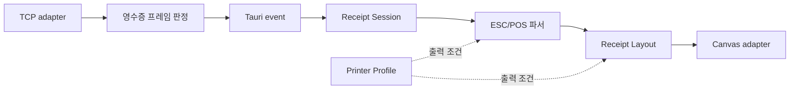

# 코드베이스 아키텍처 검토

- 검토일: 2026-08-14
- 범위: 최근 변경이 집중된 ESC/POS 파서, Canvas 영수증 표시, TCP 영수증 수신
- 근거: 최근 이미지·QR 지원 변경, 현재 소스와 테스트, 이미지·QR 스펙 문서
- 도메인 용어: [CONTEXT.md](../../CONTEXT.md)

CONTEXT.md와 docs/adr/는 검토 시작 시 없었다. 이 문서는 기존 결정을 재논의하지 않으며, 후보의 module, interface, depth, seam, adapter, leverage, locality만 다룬다.

이 문서는 임시 HTML 후보 보고서를 저장소 문서 형식으로 옮긴 영속 버전이다.

## 현재 흐름

## 후보 비교 및 적용 상태

| 후보 | 현재 마찰 | 상태 | 먼저 확인할 조건 |
| --- | --- | --- | --- |
| Printer Profile module | QR·이미지·용지 폭 정책이 파서와 Canvas에 분산 | 후보 유지 | 21/42 column 외에 실제 프린터 프로파일을 도입할지 |
| Receipt Framing module | raw payload에서 GS V 바이트 패턴을 바로 탐색 | 2026-08-14 적용 | Rust가 전체 ESC/POS를 해석하지 않고 길이 인지 탐색만 맡을지 |
| Receipt Layout module | Canvas가 기하 계산과 browser draw를 함께 소유 | 2026-08-14 적용 | 두 번째 rendering adapter가 실제로 필요한지 |
| Receipt Session module | Tauri event·영속화·변환·보존·선택이 hook 하나에 집중 | 2026-08-14 적용 | 수신 설정과 화면 보존 설정을 하나의 정책으로 둘지 |

## 적용 결과

- Receipt Framing은 receipt_framer.rs로 분리했다. 현재 지원하는 이미지·QR·바코드 명령의 선언 길이를 인지해 payload 내부의 GS V를 컷으로 오인하지 않는다.
- Receipt Layout은 receipt-layout.ts에서 순수 계산을 수행하고, Canvas는 이를 그리는 adapter가 됐다. 줄바꿈, 이미지 폭 맞춤, QR 크기는 browser 없이 단위 테스트한다.
- Receipt Session은 receipt-session.ts로 수신 변환·보존·선택 규칙을 모았다. 이제 화면 보존은 TcpServerConfig.maxReceipts를 단일 기준으로 사용한다.

## 최우선 후보: Printer Profile module

최근 이미지와 QR 작업은 같은 출력 가능 폭과 심볼 제약을 parser와 Canvas adapter에서 각각 다루게 만들었다. module을 삭제하면 546 dots, column 수, quiet zone, 이미지 축소, QR 출력 가능성 정책이 두 곳에 다시 나타난다. deletion test가 통과하므로, 이 후보는 높은 leverage와 locality를 제공한다.

다만 아직 실제 프린터 프로파일이 두 개 이상 존재하지 않으므로, 구체적인 adapter와 interface를 지금 확정하지 않는다. 먼저 21/42-column 표시 조건과 실제 프린터 조건 중 무엇을 제품의 Printer Profile로 삼을지 결정해야 한다.

## 지정 후보의 상세 문서

- [Receipt Framing module](./20260814-receipt-framing-review.md)
- [Receipt Layout module](./20260814-receipt-layout-review.md)
- [Receipt Session module](./20260814-receipt-session-review.md)
