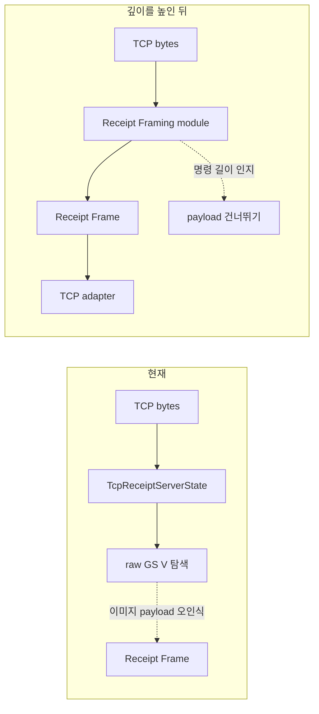

# Receipt Framing module 아키텍처 검토

- 검토일: 2026-08-14
- 추천 강도: 강력 추천
- 범위: TCP로 들어온 바이트를 하나의 [영수증 프레임](../../CONTEXT.md)으로 완료 판정하는 규칙
- 적용 상태: 2026-08-14 적용

## 적용 결과

- [receipt_framer.rs](../../apps/desktop/src-tauri/src/infrastructure/tcp/receipt_framer.rs)가 TCP byte 누적, 명령 길이 인지 탐색, 컷 프레임 배출, idle/connection 종료 시 남은 바이트 회수를 소유한다.
- [tcp_receipt_server.rs](../../apps/desktop/src-tauri/src/infrastructure/tcp/tcp_receipt_server.rs)는 socket read와 event publish만 담당하도록 줄였다.
- Framer는 현재 지원하는 ESC *, GS v 0, GS ( L, GS ( k, GS k 명령 payload를 건너뛴다. 따라서 이 payload 안의 0x1D 0x56은 컷 명령으로 해석하지 않는다.
- 단위 테스트는 raster payload·QR payload 안의 GS V, 불완전 raster payload, idle/connection 종료의 보류 바이트를 검증한다.

## 현재와 목표

## 마찰

현재 TCP adapter는 연결 수명, read, 유휴 시간 초과, 바이트 누적, 컷 탐색, 영수증 발행을 동시에 소유한다. 특히 컷 탐색은 ESC/POS 문법 일부를 알아야 하는데 raw 바이트 탐색으로 구현되어, 이미지 지원 확대가 TCP adapter의 correctness를 직접 흔든다.

이 상태에서 test는 TCP stream과 프레임 규칙을 함께 준비해야 한다. framing 규칙의 interface가 독립된 test surface가 아니므로, 잘못된 분리의 원인이 socket 처리인지 명령 길이 처리인지 알기 어렵다.

## 적용한 deepening

Receipt Framing module은 다음 implementation을 소유한다.

- 명령 헤더와 선언된 payload 길이를 따라가며 payload를 건너뛰는 탐색
- 컷, 유휴 시간 초과, 연결 종료의 완료 이유 우선순위
- 불완전 명령과 다음 TCP read를 기다려야 하는 상태
- 수신 바이트 상한과 초과 시의 진단 정책

TCP adapter는 bind, accept, read, publish만 담당한다. 이 후보는 현재 TCP adapter 하나만 사용하므로 external seam을 서둘러 만들 이유는 없다. adapter 하나는 hypothetical seam이므로, Framing module의 seam은 우선 TCP implementation 내부에 둔다.

## deletion test

Receipt Framing module을 삭제하면 명령 길이 인지 탐색, 유휴 시간 초과, 불완전 payload 처리가 handle_client와 향후 replay/file 입력마다 다시 나타난다. 복잡도가 사라지지 않고 호출자에 재등장하므로 module은 depth를 만들 수 있다.

## 검증 시나리오

| 시나리오 | 기대 | 상태 |
| --- | --- |
| GS v 0 payload 안의 0x1D 0x56 0x00 | 프레임을 완료하지 않는다 | 자동 테스트 |
| 이미지 payload 뒤의 실제 GS V | 실제 컷 위치에서만 완료한다 | 자동 테스트 |
| 이미지 헤더와 payload가 여러 TCP read로 분할 | 모든 payload를 받은 뒤에만 다음 명령을 탐색한다 | 자동 테스트 |
| GS V A n의 마지막 인자가 다음 read에 도착 | 불완전 명령으로 유지한다 | 자동 테스트 |
| 컷 없는 연결의 idle timeout | 누적 바이트 하나를 idle timeout 이유로 완료한다 | 자동 테스트 |
| 상한보다 큰 payload | 메모리 증가 대신 명시적 진단을 만든다 | 미구현 |

## 미결정 사항

1. Framing module은 어떤 명령군까지 길이를 인지해야 하는가? 최소 범위는 현재 지원하는 이미지·바코드·QR·컷 명령이다.
2. 최대 수신 바이트와 초과 시 행동을 제품 정책으로 고정할 것인가?
3. 향후 replay/file 입력이 실제 adapter가 되는 시점에 external seam으로 승격할 것인가?

최대 수신 바이트 정책은 아직 도입하지 않았으며, 이 문서의 유일한 미구현 항목이다.
