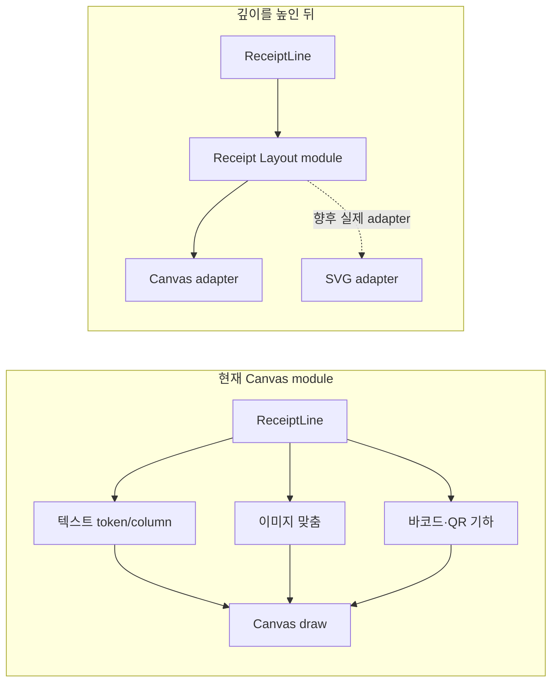

# Receipt Layout module 아키텍처 검토

- 검토일: 2026-08-14
- 추천 강도: 검토할 가치
- 범위: [영수증 레이아웃](../../CONTEXT.md)의 텍스트·이미지·바코드 기하 계산
- 적용 상태: 2026-08-14 적용

## 적용 결과

- [receipt-layout.ts](../../packages/ui/src/molecules/receipt-canvas/receipt-layout.ts)가 token 병합, wide-character column 계산, 줄바꿈, 이미지 맞춤, 1D 바코드·QR 기하를 소유한다.
- [receipt-canvas/index.tsx](../../packages/ui/src/molecules/receipt-canvas/index.tsx)는 layout 결과를 Canvas에 그리는 browser adapter로 축소했다.
- 546 dots와 21/42-column 변환은 receiptLayoutMetrics로 한곳에 모았다.
- [receipt-layout.test.ts](../../packages/ui/src/molecules/receipt-canvas/receipt-layout.test.ts)는 한글 줄바꿈, 이미지 축소, QR 폭, 빈 영수증의 기본 높이를 browser 없이 검증한다.

## 현재와 목표

## 마찰

현재 module의 implementation은 영수증 표시 규칙과 browser draw를 분리하지 않는다. 텍스트가 21 column을 넘는 경우, 이미지가 printable width를 넘는 경우, QR이 최소 pixel 크기 때문에 넘치는 경우를 검증하려면 Canvas context와 기하 규칙을 동시에 통과해야 한다.

이는 layout 결함의 locality를 낮춘다. 출력 가능 폭이나 quiet zone 정책을 바꾸면 parser, Canvas 계산, draw를 함께 이해해야 하며, interface가 test surface가 되지 못한다.

## 적용한 deepening

Receipt Layout module은 다음 implementation을 소유한다.

- ReceiptLine을 표시 단위로 나누는 column·정렬·높이 계산
- 이미지·1D 바코드·QR의 폭과 높이 계산
- 출력 가능 폭을 넘을 때의 표시 결과와 진단 정보
- 텍스트·이미지·바코드가 섞인 영수증의 세로 위치 계산

Canvas adapter는 layout 결과를 draw하는 역할로 줄인다. 이는 작은 interface 뒤에 많은 기하 implementation을 넣어 depth를 높이고, browser 없이 layout test를 가능하게 한다.

현재 physical layout을 실제로 소비하는 것은 Canvas adapter 하나다. 따라서 SVG adapter가 실제 요구가 되기 전까지 external seam을 추가하지 않는다. adapter 하나는 hypothetical seam이라는 원칙을 따른다.

## deletion test

Receipt Layout module을 삭제하면 줄바꿈, 폭 계산, QR·이미지 크기, 세로 위치 규칙이 Canvas adapter에 다시 집중된다. 복잡도가 사라지지 않고 draw 호출자에 재등장하므로 module은 leverage와 locality를 만든다.

## 검증 시나리오

| 시나리오 | 기대 |
| --- | --- |
| 21 column의 한글·영문 혼합 텍스트 | wide-character column 규칙으로 안정적으로 줄바꿈 |
| 42 column보다 넓은 raster image | profile 정책에 따른 축소 또는 명시적 초과 표시 |
| QR 최소 module 크기가 printable width를 넘음 | 조용한 clipping 대신 검증 가능한 결과 |
| 가운데 정렬 이미지와 오른쪽 정렬 텍스트 | 각 표시 단위의 정렬이 독립적으로 유지 |
| 바코드 HRI 위·아래 텍스트 | 기하 높이와 다음 줄의 위치가 일치 |
| 이미지·QR·텍스트가 한 영수증에 혼합 | 총 높이와 순서가 재현 가능 |

## 미결정 사항

1. Printer Profile module이 먼저 도입되어야 layout이 실제 dots를 근거로 계산할 수 있는가?
2. QR quiet zone을 표시 정책으로 둘지, profile 값으로 둘지?
3. HTML/SVG 출력이 Canvas와 동일한 physical layout을 요구하는가?

Printer Profile이 도입되면 receiptLayoutMetrics의 물리 폭 정책을 그 profile에서 받도록 확장할 수 있다.
