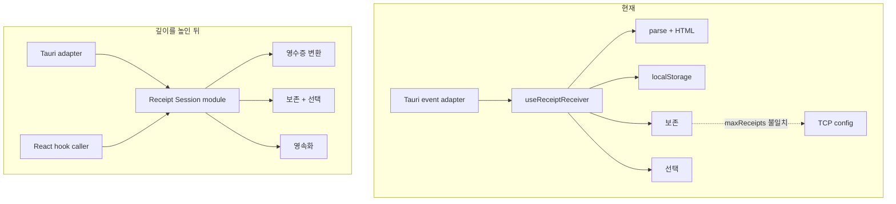

# Receipt Session module 아키텍처 검토

- 검토일: 2026-08-14
- 추천 강도: 검토할 가치
- 범위: 수신 영수증의 보관, 선택, 변환, 화면 상태
- 적용 상태: 2026-08-14 적용

## 적용 결과

- [receipt-session.ts](../../apps/desktop/src/features/receipt-receiver/model/receipt-session.ts)가 수신 payload의 ParseResult·HTML 변환, 최신순 보존, 선택 유지·교체, 초기화 규칙을 소유한다.
- [useReceiptReceiver.ts](../../apps/desktop/src/features/receipt-receiver/model/useReceiptReceiver.ts)는 localStorage, Tauri event, 명령, 오류라는 adapter 역할과 Session 호출만 담당한다.
- 화면 보존은 별도 상수 없이 TcpServerConfig.maxReceipts를 사용한다. 선택된 영수증이 보존 한도에서 제거되면 최신 영수증을 선택한다.
- [receipt-session.test.ts](../../apps/desktop/src/features/receipt-receiver/model/receipt-session.test.ts)는 첫 수신 선택, 선택 유지, 보존 한도 초과, 알 수 없는 선택, 초기화를 검증한다.
- desktop 수신의 euc-kr 해석 정책은 Session 안에 명시했지만, 설정으로 노출하지는 않았다.

## 현재와 목표

## 마찰

현재 hook의 interface는 설정, 상태, 목록, 선택, 오류, 명령, 바이트 포맷을 한 번에 노출한다. implementation의 변경 범위도 넓다. 보존 한도를 바꾸려면 Tauri config, localStorage, hard-coded 상수, UI를 함께 추적해야 한다.

event가 도착했을 때 ReceiptViewModel을 만드는 규칙과 선택 규칙은 React state 갱신 안에 있다. 따라서 test가 interface를 통해 영수증 lifecycle을 검증하기보다 Tauri listen과 React hook을 함께 준비해야 한다. locality가 낮고, 동일한 수신 규칙을 다른 화면에서 재사용하기 어렵다.

## 적용한 deepening

Receipt Session module은 다음 implementation을 소유한다.

- 수신 payload를 ParseResult와 HTML을 가진 화면용 영수증으로 변환하는 정책
- 보존 상한, 최신 영수증 우선 정렬, 선택 유지·초기 선택 규칙
- 오류와 TCP 상태의 전이
- 저장할 설정과 일시 상태의 구분
- 문자 인코딩 같은 수신 해석 정책

React hook은 Receipt Session module의 caller이고, Tauri는 현재 유일한 transport adapter다. 따라서 test만을 이유로 transport port를 추가하지 않는다. Receipt Session module의 작은 interface가 test surface가 되면, Tauri runtime 없이도 event 순서와 보존 불변 조건을 검증할 수 있다.

## deletion test

Receipt Session module을 삭제하면 수신 변환, 보존, 선택, 설정 적용 규칙이 hook과 향후 다른 화면에 다시 흩어진다. 동일 영수증 lifecycle을 보존하려는 호출자가 늘수록 복잡도가 재등장하므로, 이 module은 depth와 leverage를 제공한다.

## 검증 시나리오

| 시나리오 | 기대 |
| --- | --- |
| 첫 영수증 수신 | 새 영수증이 선택된다 |
| 선택된 영수증이 있고 새 영수증 수신 | 기존 선택을 유지한다 |
| 보존 상한보다 많은 영수증 수신 | 최신순과 상한이 같은 정책으로 유지된다 |
| 상한 설정을 변경한 뒤 수신 | hard-coded 값 없이 새 설정이 적용된다 |
| 상태 조회 실패 | 수신 목록은 손상되지 않고 stopped 상태를 표시한다 |
| TCP 오류 event | 오류가 표시되고 이후 수신 event는 계속 처리한다 |
| UTF-8과 EUC-KR 수신 정책 | 명시된 설정에 따라 같은 바이트를 일관되게 해석한다 |

## 미결정 사항

1. maxReceipts는 TCP server config가 아니라 화면 보존 정책으로 분리해야 하는가?
2. 수신 textEncoding은 server 설정, 영수증별 메타데이터, 또는 전역 profile 중 어디에 속하는가?
3. replay/file 입력이 실제 transport adapter가 되는 시점에 transport seam을 외부로 승격할 것인가?

문자 인코딩과 화면 보존 정책을 분리할지는 여전히 제품 결정이 필요하다.
