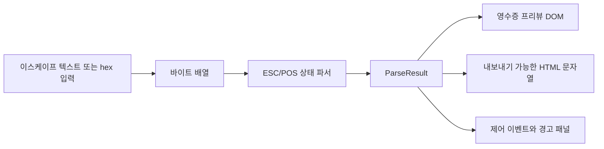

# ESC/POS 파싱 중간 데이터 모델

이 문서는 ESC/POS 원본 입력을 HTML 프리뷰로 렌더링하기 전에 생성할 중간 데이터 형식을 정의합니다.

파싱과 HTML 렌더링 로직은 모노레포의 `packages/escpos` 패키지에 둡니다. 웹앱은 `apps/web`에서 이 패키지를 workspace dependency로 사용합니다.

## 목표

파서는 ESC/POS 바이트를 HTML 문자열로 바로 바꾸지 않습니다. 먼저 검사, 테스트, 확장, 렌더링이 쉬운 영수증 중심의 문서 모델로 정규화합니다.

중간 데이터 모델은 다음 역할을 맡습니다.

- 출력 순서대로 보이는 텍스트를 보존합니다.
- 굵게, 밑줄, 반전, 폰트, 글자 크기 같은 텍스트 스타일 상태를 기록합니다.
- 왼쪽, 가운데, 오른쪽 정렬 같은 줄 단위 레이아웃을 기록합니다.
- 컷, 용지 피드, 비프, 금전함 펄스처럼 텍스트가 아닌 프린터 제어 명령을 이벤트로 보존합니다.

## 처리 흐름

1. 원본 입력을 바이트 배열로 디코딩합니다.
2. ESC/POS 상태 머신으로 바이트 배열을 순회합니다.
3. 정규화된 `ParseResult`를 생성합니다.
4. `ParseResult.lines`를 영수증 HTML로 렌더링합니다.
5. `ParseResult.events`와 `ParseResult.warnings`는 영수증 본문 밖의 패널에 표시합니다.



## 입력 형식

초기 버전은 두 가지 입력 모드를 지원합니다.

### 이스케이프 텍스트

이스케이프 텍스트는 샘플을 붙여넣거나 테스트를 작성하기 쉽게 만든 입력 형식입니다.

지원하는 이스케이프 시퀀스는 다음과 같습니다.

- `\x1b`: 1바이트 hex 이스케이프입니다.
- `\u001b`: Unicode 이스케이프이며 UTF-8로 인코딩합니다.
- `\e` 또는 `\E`: ESC 바이트, `0x1b`입니다.
- `\g` 또는 `\G`: GS 바이트, `0x1d`입니다.
- `\n`, `\r`, `\t`, `\b`, `\0`, `\\`.

일반 문자는 UTF-8 바이트로 인코딩합니다.

가독성을 위해 `\e a\x01`, `\g V\x00`처럼 `\e` 또는 `\g` 바로 뒤에 있는 공백과 탭은 명령 구분자로 보고 제거합니다. 따라서 `\e a\x01`은 실제 바이트 `1B 61 01`로 해석되고, `a`가 출력 텍스트로 렌더링되지 않습니다.

### Hex

Hex 모드는 입력에서 두 자리 hex 값을 모두 추출하고 구분자는 무시합니다. 아래처럼 공백으로 구분된 형식도 허용합니다.

```text
1B 40 1B 61 01 48 65 6C 6C 6F 0A
```

## 중간 타입

파서의 루트 결과는 다음과 같습니다.

```ts
type ParseResult = {
  lines: ReceiptLine[]
  events: ControlEvent[]
  warnings: string[]
  bytes: number[]
}
```

### ReceiptLine

`ReceiptLine`은 영수증 레이아웃의 줄 단위 모델입니다.

```ts
type ReceiptLine = {
  align: 'left' | 'center' | 'right'
  spans: ReceiptSpan[]
}
```

`align` 값은 줄이 만들어지거나 `ESC a n` 명령으로 정렬이 바뀌는 시점의 파서 상태를 반영합니다.

### ReceiptSpan

`ReceiptSpan`은 같은 스타일을 공유하는 최소 텍스트 범위입니다.

```ts
type ReceiptSpan = {
  text: string
  style: TextStyle
}
```

인접한 텍스트가 같은 `TextStyle`을 가지면 하나의 span으로 병합합니다. 이렇게 하면 모델이 작아지고 생성되는 HTML도 단순해집니다.

### TextStyle

`TextStyle`은 span이 생성되는 순간의 활성 출력 스타일을 저장합니다.

```ts
type TextStyle = {
  bold: boolean
  underline: 0 | 1 | 2
  inverted: boolean
  width: number
  height: number
  font: 'A' | 'B' | 'C'
}
```

초기 구현에서는 `GS ! n` 명령의 일반적인 인코딩에 맞춰 `width`와 `height`를 `1`부터 `8`까지의 정수 배율로 다룹니다.

### ControlEvent

화면에 보이는 텍스트를 만들지 않는 프린터 제어 명령은 별도 이벤트로 생성합니다.

```ts
type ControlEvent = {
  type: 'cut' | 'drawer' | 'beep' | 'feed' | 'unknown'
  label: string
  offset: number
}
```

프리뷰는 이런 명령을 조용히 버리지 않아야 합니다. 사용자가 원본 ESC/POS 시퀀스에 실제 동작 명령이 포함되어 있는지 확인할 수 있도록 별도 패널에 표시합니다.

## 지원할 ESC/POS 명령

초기 파서는 일반적인 영수증 출력에 자주 쓰이는 실용적인 하위 집합을 지원합니다.

| 명령 | 의미 | 모델 반영 |
| --- | --- | --- |
| `LF` | 한 줄 출력 및 피드 | 텍스트를 flush하고 새 `ReceiptLine` 생성 |
| `CR` | 캐리지 리턴 | 무시 |
| `BEL` | 비프 | `ControlEvent` 추가 |
| `ESC @` | 프린터 초기화 | 스타일과 정렬 상태 초기화 |
| `ESC E n` | 굵게 켜기/끄기 | `TextStyle.bold` 갱신 |
| `ESC - n` | 밑줄 끄기/켜기/두껍게 | `TextStyle.underline` 갱신 |
| `ESC a n` | 정렬 | 활성 줄 정렬 갱신 |
| `ESC M n` | 폰트 선택 | `TextStyle.font` 갱신 |
| `ESC d n` | n줄 피드 | 빈 줄 생성 및 `ControlEvent` 추가 |
| `ESC p m t1 t2` | 금전함 펄스 | `ControlEvent` 추가 |
| `GS ! n` | 글자 크기 | `TextStyle.width`, `TextStyle.height` 갱신 |
| `GS B n` | 반전 인쇄 모드 | `TextStyle.inverted` 갱신 |
| `GS V ...` | 용지 컷 | `ControlEvent` 추가 |

지원하지 않는 명령이 있어도 프리뷰가 중단되면 안 됩니다. 가능하면 바이트 offset이 포함된 경고를 만들고 계속 파싱합니다.

## HTML 렌더링 규칙

HTML 렌더링은 중간 데이터 모델만 소비합니다.

`ReceiptLine`은 다음 형태로 매핑합니다.

```html
<div class="receipt-line align-left">...</div>
```

`ReceiptSpan`은 다음 형태로 매핑합니다.

```html
<span style="...">text</span>
```

텍스트 내용은 반드시 HTML escape 처리합니다. 스타일은 내보내기용 HTML에서는 inline style로, React 프리뷰에서는 class와 style 객체 조합으로 표현할 수 있습니다.

권장 매핑은 다음과 같습니다.

- `bold`: `font-weight: 800`.
- `underline`: `text-decoration: underline`.
- `inverted`: 어두운 배경과 밝은 글자색.
- `width`: 가로 스케일.
- `height`: 폰트 크기 배율.
- `font`: B/C 폰트는 더 작은 폰트 크기.

기본 스타일 span은 렌더링 옵션으로 제어합니다. `wrapPlainTextSpans`가 `true`이면 기본 텍스트도 `<span>a</span>` 형태로 출력하고, `false`이면 기본 스타일 텍스트는 `a`처럼 텍스트 노드로 출력합니다. 스타일이 적용된 span은 옵션과 관계없이 `<span style="...">`로 출력합니다.

프리뷰 DOM은 ESC/POS 프린터의 고정폭 컬럼 모델을 흉내 내기 위해 텍스트를 문자 셀로 렌더링합니다. ASCII 문자는 1컬럼, 한글/CJK 전각 문자는 2컬럼으로 표시합니다. 이 처리는 화면 프리뷰용이며, 중간 데이터의 `ReceiptSpan.text` 값은 원본 텍스트를 유지합니다.

입력 에디터도 같은 컬럼 폭 규칙을 사용합니다. 실제 입력 제어는 `textarea`가 담당하고, 화면 표시에는 문자 셀 기반 미러 레이어를 사용합니다. 이렇게 해야 사용자가 한글이 포함된 ESC/POS 샘플을 편집할 때도 프린터의 1바이트/2바이트 컬럼 정렬을 더 정확히 볼 수 있습니다.

## 확장 계획

이 모델은 프린터의 저수준 내부 구조 대신 영수증 표현에 필요한 정보를 우선합니다. 이후 다음 기능을 추가할 수 있습니다.

- 이미지 명령을 `ReceiptBlock` 레코드로 표현.
- 바코드와 QR 명령을 구조화된 block으로 표현.
- 코드 페이지 선택과 명시적 텍스트 디코딩.
- 영수증 합계 영역을 위한 컬럼 레이아웃 헬퍼.
- 실제 프린터 명령 시퀀스 기반 테스트 fixture.

## 샘플 데이터 정책

앱의 샘플은 `apps/web/src/entities/sample/model.ts`에서 관리합니다. 각 샘플은 다음 정보를 가집니다.

```ts
type EscposSample = {
  id: string
  title: string
  description: string
  mode: InputMode
  input: string
}
```

샘플은 `/samples/:sampleId` 라우트로 접근합니다. 초기 샘플에는 기본 카페 영수증, 한글 영수증, 스타일 확인용 샘플, hex 입력 샘플, 제어 이벤트 샘플, 경고 확인용 샘플을 포함합니다.

한글 샘플은 현재 UTF-8 텍스트 입력을 기준으로 프리뷰합니다. 실제 ESC/POS 프린터의 코드 페이지, CP949, EUC-KR 같은 바이트 인코딩을 완전히 재현하는 것은 별도 확장 항목으로 둡니다.
